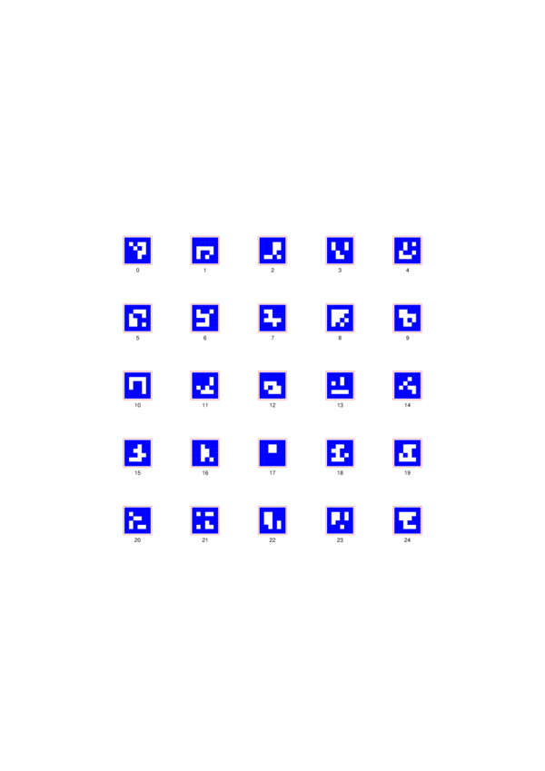
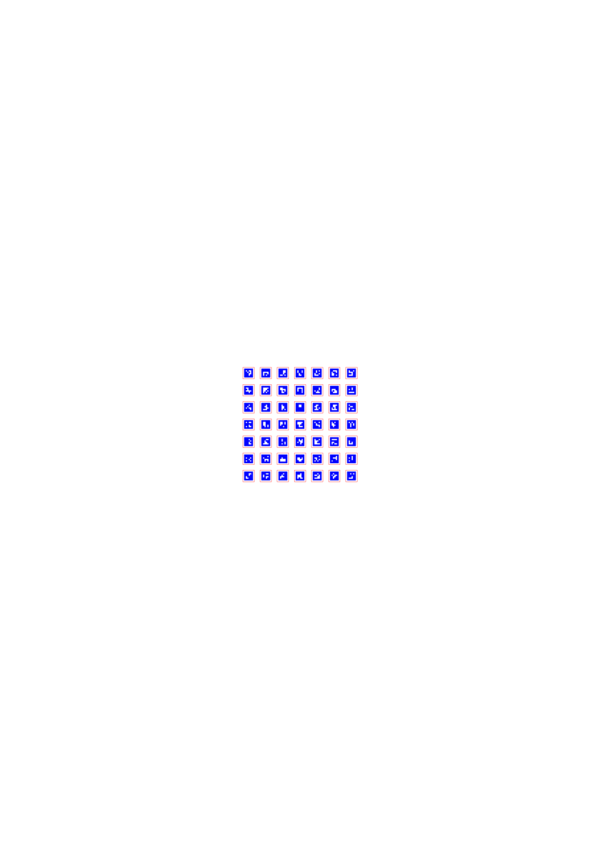
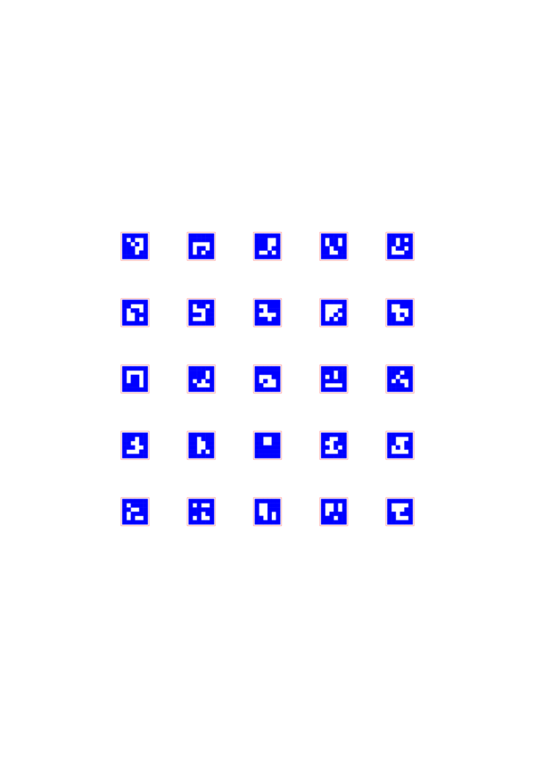
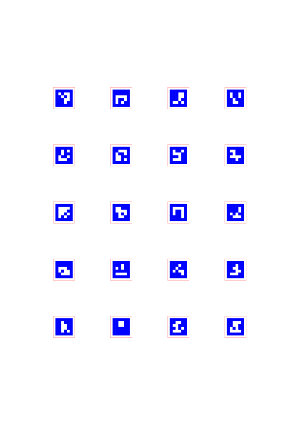

# ArUco Marker Generator for Laser Cutting

[](https://doi.org/10.5281/zenodo.17613883)

A Python tool for generating clean, optimized ArUco markers specifically designed for laser cutting and engraving with color-coded layers.

**Author:** Pavan Kumar Kaushik

---

## 🎯 Example Outputs

The repository includes **25 comprehensive example PDFs** demonstrating all parameters and use cases. View them in the [`examples/`](examples/) directory.

### Preview

<div align="center">

| Standard Markers | Compact Layout | Custom Grid | Production Ready |
|:---:|:---:|:---:|:---:|
| [](examples/01_standard_10mm_with_labels.pdf) | [](examples/05_compact_3mm_dense.pdf) | [](examples/18_custom_grid_5x5.pdf) | [](examples/24_production_standard.pdf) |
| **Standard 10mm**<br/>With labels | **Compact 3mm**<br/>Dense layout | **Custom 5×5**<br/>Grid layout | **Production**<br/>12mm standard |

*Click images to view full PDF examples*

</div>

---

## ✨ Features

- ✅ **Clean Vector Output** - Logical grid level generation (not pixelated)
- ✅ **Color-Coded Layers** - Blue (RGB: 0,0,255) for engraving, Red (RGB: 255,0,0) for cutting
- ✅ **Multiple Dictionaries** - Supports 4×4, 5×5, 6×6, and 7×7 ArUco dictionaries
- ✅ **Flexible Configuration** - Customize size, spacing, borders, page size, and grid layout
- ✅ **Batch Generation** - Generate specific IDs, ranges, or entire dictionaries
- ✅ **Optional Labels** - Toggle marker ID labels on/off

---

## 🚀 Quick Start

### With UV (Recommended)

```bash
# Install UV (one-time)
curl -LsSf https://astral.sh/uv/install.sh | sh

# Generate markers (UV handles dependencies automatically)
uv run generate_aruco_laser.py -r 0 9
```

### With pip

```bash
pip install opencv-python numpy reportlab
python generate_aruco_laser.py -r 0 9
```

---

## 📖 Usage Examples

```bash
# Generate first 10 markers
uv run generate_aruco_laser.py -r 0 9

# Compact 3mm markers, dense layout
uv run generate_aruco_laser.py -s 3 --spacing 2 --no-labels

# Custom grid layout
uv run generate_aruco_laser.py --nrows 5 --ncols 4 -r 0 19

# Different dictionary
uv run generate_aruco_laser.py --dict 5X5_100 -r 0 20
```

---

## 🖼️ Example Outputs

The repository includes **25 comprehensive example PDFs** demonstrating all parameters. View them in the [`examples/`](examples/) directory.

### Quick Reference

| Category | Examples | Description |
|----------|----------|-------------|
| **Standard** | [01](examples/01_standard_10mm_with_labels.pdf), [02](examples/02_standard_10mm_no_labels.pdf) | 10mm markers with/without labels |
| **Page Sizes** | [03](examples/03_letter_page_size.pdf), [04](examples/04_a4_page_size.pdf) | Letter and A4 page sizes |
| **Sizes** | [05](examples/05_compact_3mm_dense.pdf), [06](examples/06_medium_15mm_standard.pdf), [07](examples/07_large_25mm_high_visibility.pdf) | 3mm, 15mm, 25mm markers |
| **Borders** | [08](examples/08_minimal_border_0.5mm.pdf), [09](examples/09_standard_border_1mm.pdf), [10](examples/10_thick_border_3mm.pdf) | 0.5mm, 1mm, 3mm borders |
| **Spacing** | [11](examples/11_tight_spacing_5mm.pdf), [12](examples/12_standard_spacing_20mm.pdf), [13](examples/13_generous_spacing_40mm.pdf) | 5mm, 20mm, 40mm spacing |
| **Dictionaries** | [14-17](examples/) | 4×4, 5×5, 6×6, 7×7 dictionaries |
| **Layouts** | [18-21](examples/) | Custom grid layouts |
| **Production** | [24](examples/24_production_standard.pdf), [25](examples/25_production_compact.pdf) | Production-ready configs |

See [examples/README.md](examples/README.md) for complete descriptions.

---

## ⚙️ Command-Line Options

| Option | Description | Default |
|--------|-------------|---------|
| `--dict DICT` | ArUco dictionary (4X4_50, 5X5_100, etc.) | 4X4_50 |
| `-o FILE` | Output PDF filename | aruco_markers.pdf |
| `-s SIZE` | Marker size in millimeters | 10.0 |
| `-b BORDER` | Border width in millimeters | 0.5 |
| `--spacing SIZE` | Space between markers in mm | 20.0 |
| `-i ID [ID ...]` | Specific marker IDs to generate | All markers |
| `-r START END` | Generate range of IDs (inclusive) | - |
| `-p NUM` | Number of markers per page | 20 |
| `--nrows NUM` | Explicit number of rows per page | Auto-calculated |
| `--ncols NUM` | Explicit number of columns per page | Auto-calculated |
| `--page-size SIZE` | Page size (A4 or letter) | A4 |
| `--no-labels` | Don't show marker ID labels | Show labels |

Run `uv run generate_aruco_laser.py --help` for complete help.

---

## 📚 Available Dictionaries

| Dictionary | Marker Count | Grid Size | Best For |
|------------|--------------|-----------|----------|
| **4X4_50** | 50 | 4×4 (6×6 with border) | Small projects, compact markers |
| 4X4_100 | 100 | 4×4 (6×6 with border) | Medium projects |
| 4X4_250 | 250 | 4×4 (6×6 with border) | Large projects |
| 4X4_1000 | 1000 | 4×4 (6×6 with border) | Very large projects |
| **5X5_100** | 100 | 5×5 (7×7 with border) | Better detection reliability |
| 5X5_250 | 250 | 5×5 (7×7 with border) | Large projects with better detection |
| 5X5_1000 | 1000 | 5×5 (7×7 with border) | Very large projects |
| 6X6_250 | 250 | 6×6 (8×8 with border) | Maximum detection reliability |
| 6X6_1000 | 1000 | 6×6 (8×8 with border) | Very large projects, best detection |
| 7X7_1000 | 1000 | 7×7 (9×9 with border) | Extreme conditions |

---

## 🔥 Laser Cutting Setup

### In Lightburn

1. **Import the PDF** - File → Import → Select your generated PDF
2. **Layers are auto-assigned by color:**
   - **Blue shapes** → Engraving layer (Fill mode)
   - **Red outlines** → Cutting layer (Line mode)
3. **Configure settings** (adjust for your material):
   - Blue Layer: Fill mode, 1000-1500 mm/min, 10-20% power
   - Red Layer: Line mode, 10-20 mm/min, 70-100% power
4. **Test on scrap material first!**

See [USER_GUIDE.md](USER_GUIDE.md) for detailed laser setup instructions.

---

## 📖 Citation

If you use this software in your research, please cite it:

**DOI:** [10.5281/zenodo.17613883](https://doi.org/10.5281/zenodo.17613883)

### BibTeX
```bibtex
@software{kaushik2024aruco,
  author = {Kaushik, Pavan Kumar},
  title = {ArUco Marker Generator for Laser Cutting},
  version = {1.0.0},
  year = {2024},
  doi = {10.5281/zenodo.17613883},
  url = {https://github.com/pavankaushik/aruco-laser-generator}
}
```

### APA
```
Kaushik, P. K. (2024). ArUco Marker Generator for Laser Cutting (Version 1.0.0) 
[Computer software]. https://doi.org/10.5281/zenodo.17613883
```

A `CITATION.cff` file is included for automatic citation generation.

---

## 📚 Documentation

- **[INSTALL.md](INSTALL.md)** - Installation instructions
- **[QUICKSTART.md](QUICKSTART.md)** - Quick start guide
- **[USER_GUIDE.md](USER_GUIDE.md)** - Complete user manual
- **[DOCS_INDEX.md](DOCS_INDEX.md)** - Documentation index
- **[Examples](examples/)** - 25 example PDFs

---

## 📋 Requirements

- Python 3.8+
- opencv-python >= 4.8.0
- numpy >= 1.24.0
- reportlab >= 4.0.0

---

## 📄 License

MIT License - Free to use and modify for your projects!

---

## 🔗 Links

- **Repository**: [GitHub](https://github.com/pavankaushik/aruco-laser-generator)
- **DOI**: [10.5281/zenodo.17613883](https://doi.org/10.5281/zenodo.17613883)
- **OpenCV ArUco**: [Documentation](https://docs.opencv.org/4.x/d5/dae/tutorial_aruco_detection.html)

---

**Need help?** Run `uv run generate_aruco_laser.py --help` for all options.
